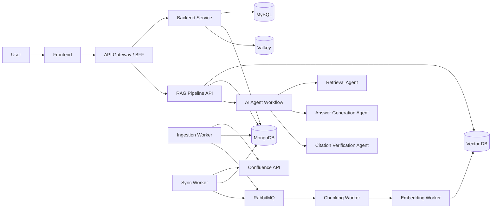
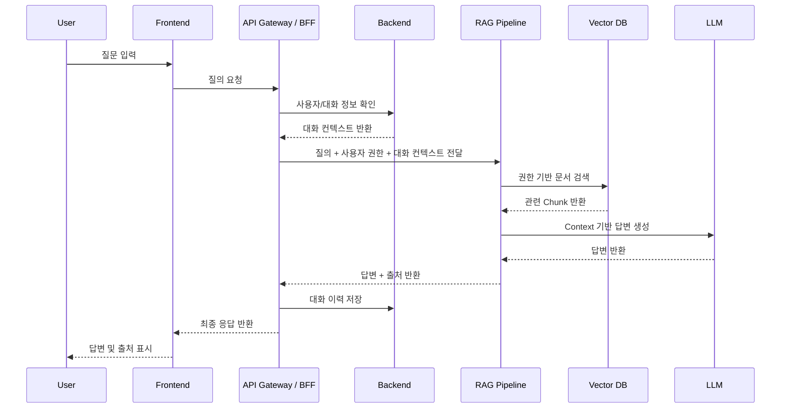
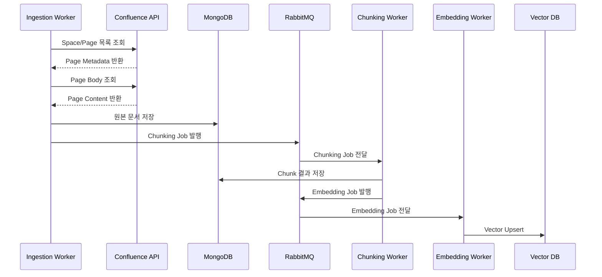

# Architecture

이 문서는 프로젝트의 전체 아키텍처, 주요 컴포넌트, 데이터 흐름, 기술 스택, 의존 관계를 정의한다.

---

## 1. 프로젝트 개요

본 프로젝트는 Confluence 등 사내 문서에 축적된 업무 지식과 히스토리를 자연어로 검색하고 답변하는 RAG 기반 사내 지식 검색 서비스이다.

사용자는 채팅 UI를 통해 질문을 입력하고, 시스템은 사용자의 권한을 고려하여 관련 문서를 검색한 뒤 답변과 출처를 함께 제공한다.

---

## 2. 주요 목표

- 사내 문서 검색 시간 단축
- 자연어 기반 질의응답 제공
- 출처 기반 답변 제공
- 사용자 권한을 고려한 검색 결과 제공
- 문서 변경 사항을 반영하는 데이터 동기화 구조 구축
- 운영 가능한 Backend, Frontend, RAG Pipeline, AI Agent 구조 설계

---

## 3. 주요 컴포넌트

| 컴포넌트 | 역할 |
|---|---|
| Frontend | 사용자 채팅 UI, 관리자 UI, 출처 표시 |
| API Gateway / BFF | 단일 진입점, 인증 확인, 요청 라우팅, 응답 조합 |
| Backend | 인증, 대화 이력, 피드백, 사용자/권한 관리 |
| RAG Pipeline | 문서 검색, 재정렬, 답변 생성, 출처 검증 |
| AI Agent | 질의 분석, 라우팅, 답변 생성, 답변 검증 등 Agent Workflow |
| Ingestion Worker | Confluence 문서 수집 |
| Sync Worker | 변경 문서 감지 및 델타 업데이트 |
| MySQL | 사용자, 대화, 피드백 등 정형 데이터 저장 |
| MongoDB | 원본 문서, 파싱 결과, Chunk 메타데이터 저장 |
| Vector DB | Embedding Vector 저장 및 유사도 검색 |
| RabbitMQ | 비동기 작업 큐 |

---

## 4. 전체 아키텍처



---

## 5. 요청 처리 흐름

### 5.1 사용자 질의 흐름



---

### 5.2 문서 수집 흐름



---

## 6. 데이터 저장 전략

### 6.1 MySQL

MySQL은 정형 데이터 저장에 사용한다.

저장 대상:

- 사용자 계정
- OAuth 인증 정보
- 조직/권한 관계
- 대화방
- 메시지
- 피드백
- 서비스 설정

---

### 6.2 MongoDB

MongoDB는 문서 중심 데이터를 저장한다.

저장 대상:

- Confluence 원본 문서
- 파싱 결과
- Chunk 데이터
- 문서 메타데이터
- 수집 작업 상태
- 동기화 로그
- 실패 로그

---

### 6.3 Vector DB

Vector DB는 Embedding Vector 검색에 사용한다.

저장 대상:

- Chunk Embedding
- 문서 ID
- Page ID
- Space ID
- 권한 필터용 메타데이터
- 최신 수정일
- 출처 정보

---

### 6.4 RabbitMQ

RabbitMQ는 비동기 작업 큐로 사용한다.

사용 목적:

- 문서 수집과 Chunking 분리
- Chunking과 Embedding 분리
- 실패 작업 재시도
- DLQ 기반 실패 추적
- API Rate Limit 대응
- Worker 단위 확장

---

## 7. Backend 아키텍처

Backend는 Spring Boot 3.x, Java 21 기반으로 구성한다.

주요 역할:

- 사용자 인증/인가
- OAuth 연동
- 대화 이력 관리
- 피드백 저장
- RAG Pipeline 호출
- 관리자 기능 제공
- 공통 예외 처리
- API 응답 표준화

계층 구조:

```text
controller
service
repository
client
dto
entity
config
exception
```

규칙:

- Controller는 요청/응답 처리만 담당한다.
- Service는 비즈니스 로직과 트랜잭션을 담당한다.
- Repository는 DB 접근만 담당한다.
- Client는 외부 API 호출을 담당한다.
- Entity를 API 응답으로 직접 반환하지 않는다.

---

## 8. Frontend 아키텍처

Frontend는 사용자 채팅 화면과 관리자 화면을 제공한다.

주요 역할:

- 로그인 화면
- 채팅 UI
- 답변 및 출처 표시
- 대화 이력 표시
- 피드백 입력
- 관리자 설정 화면

규칙:

- API 응답 타입을 임의로 추정하지 않는다.
- Loading, Error, Empty 상태를 처리한다.
- 공통 컴포넌트를 재사용한다.
- 서버 상태와 UI 상태를 분리한다.

---

## 9. RAG Pipeline 아키텍처

RAG Pipeline은 Confluence 본문·첨부(PDF/Word/Excel) 텍스트를 색인하고, 사용자 질의에 대해
권한 기반 검색 → 답변 생성 → 출처 검증을 수행한다. 본 저장소가 담당하는 영역이며, 상세 설계는
다음 문서를 따른다.

- RAG 파이프라인 설계: `docs/rag-pipeline-design.md` (설계서 v0.2.2 기준)
- Adaptive Chunking 전략: `docs/chunking-strategy.md`
- 데이터 저장소 스키마: `docs/db-schema.md`
- API 계약: `docs/api-spec.md`

파이프라인은 두 갈래로 구성된다.

### 9.1 Ingestion 파이프라인

표준 PageObject 수신 → 문서 분석기 `[Agent]` → 첨부 파일 분석기 `[Pipeline]` → Adaptive
Chunker `[Pipeline]` → Dual Embedding `[Pipeline]` → Multi-Pool Vector Store(Qdrant) `[Storage]`.
삭제 동기화는 Reconciliation 중심의 3중 전략으로 고스트 데이터를 방지한다.

### 9.2 Query 파이프라인

ACL Pre-filtering `[Pipeline]` → 멀티턴 히스토리 관리자 `[Agent]` → 질의 라우터 `[Agent]` →
Multi-Pool Hybrid Search + Cross-Encoder 재순위화 `[Pipeline]` → 답변 생성기 `[Agent]` →
답변 검증 `[Pipeline + Agent]` → 응답 포맷터 `[Pipeline]`.

### 9.3 규칙

- 모든 컴포넌트는 `[Agent]` / `[Pipeline]` / `[Storage]` 분류를 명시한다.
- ACL Pre-filtering을 우회하지 않는다. 검색 호출은 `@enforce_acl`로 시스템 단에서 강제한다.
- Retrieval 결과 없이 답변을 생성하지 않는다 (검색 0건 → 표준 분기 응답).
- 출처가 불명확하거나 검증 실패한 답변은 제한한다.
- 답변 문장과 출처 Chunk의 연결 관계(citation)를 유지한다.

---

## 10. AI Agent 아키텍처

AI Agent는 질의 분석, 라우팅, 답변 생성, 답변 검증 등 역할별 Agent로 구성한다.

예시 Agent:

| Agent | 역할 |
|---|---|
| History Agent | 대화 이력 정리 |
| Intent Agent | 사용자 의도 분석 |
| Routing Agent | 검색/요약/일반 질의 라우팅 |
| Retrieval Agent | 검색 전략 선택 |
| Answer Agent | 답변 생성 |
| Verification Agent | 답변과 출처 정합성 검증 |

규칙:

- Agent별 책임을 명확히 분리한다.
- Agent 입력/출력 형식을 문서화한다.
- Prompt 변경 시 변경 이유를 기록한다.
- 검증 Agent는 생성 Agent와 분리한다.

---

## 11. 배포 아키텍처

프로젝트는 Kubernetes 기반 배포를 고려한다.

예상 구성:

```text
ingress
api-gateway-bff
backend
rag-pipeline
ingestion-worker
sync-worker
chunking-worker
embedding-worker
mysql
mongodb
rabbitmq
valkey
vector-db
```

규칙:

- 외부 진입점은 Ingress로 통제한다.
- 내부 서비스는 Cluster 내부 통신을 우선한다.
- Secret은 코드에 포함하지 않는다.
- 환경 변수는 배포 환경에서 주입한다.
- Health Check와 Readiness Check를 구성한다.

---

## 12. 아키텍처 변경 규칙

아키텍처 변경이 필요한 경우 다음 절차를 따른다.

1. 변경 필요성 정리
2. 영향 범위 확인
3. 대안 비교
4. 선택 이유 문서화
5. 관련 문서 수정
6. 테스트 및 검증

아키텍처 변경 시 수정할 수 있는 문서:

- `docs/architecture.md`
- `docs/api-spec.md`
- `docs/db-schema.md`
- `docs/conventions.md`
- `docs/adr/*.md`

---

## 13. 금지 사항

- 인증/인가 흐름을 임의로 우회하지 않는다.
- 권한 필터 없이 Vector DB 검색 결과를 사용자에게 제공하지 않는다.
- 출처 검증 없이 답변을 확정하지 않는다.
- DB Schema 변경 후 문서를 수정하지 않은 상태로 완료하지 않는다.
- 실험성 Agent나 Prompt를 production path에 직접 연결하지 않는다.
- 외부 API Token이나 Secret을 코드에 포함하지 않는다.
